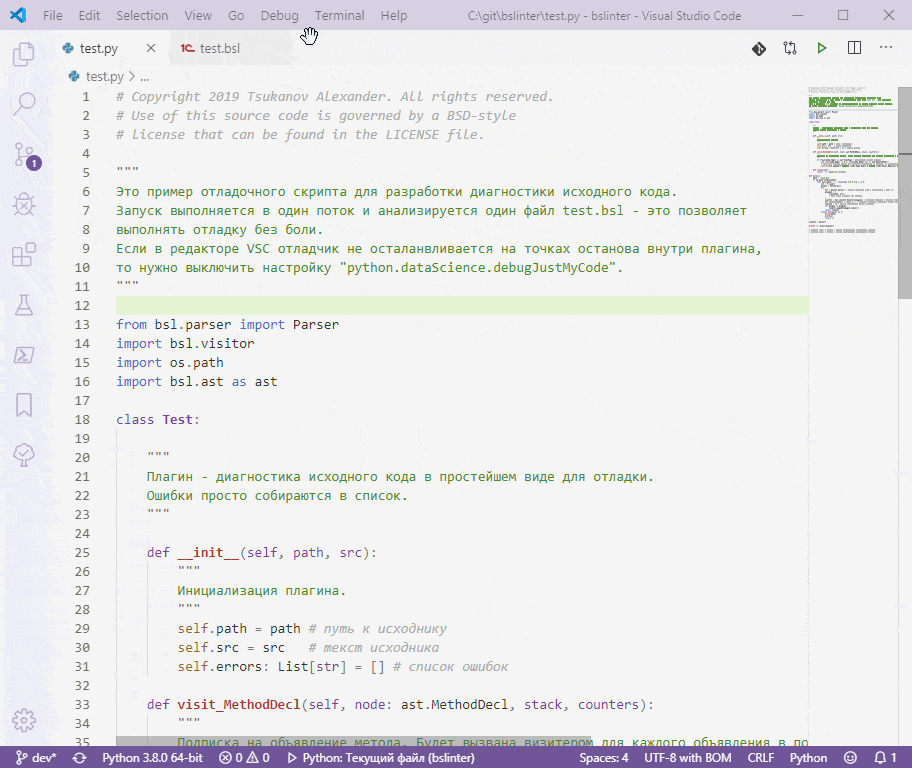

# bslinter

Чат: https://t.me/bslinter

Используется:
* python 3.8
* VSC
* vscode-python
* vscode-python-test-adapter
* mypy
* pytest

Философия:
* KISS
* не сцы

История:
Код изначально был написан на языке 1С в 2017 году.
Почти сразу был переписан на Lua и Go в черновом варианте для оценки.
В сообществе разработчиков оказался не востребованным.

Сейчас я решил переписать это для себя на питон по следующим причинам:
* изучаю питон
* на питоне проще писать
* питон быстрее в 5 раз
* питон гораздо выразительнее и мощнее
* питон имеет богатую экосистему инструментов анализа и визуализации

Сравнительная производительность имплементаций парсера кода (анализ около 6 миллионов строк кода):
1. Go ~ 24 сек. (1 поток)
2. Python ~ 80 сек. (6 потоков)
3. Lua ~ 120 сек. (1 поток)
4. 1С:Предприятие ~ 6 минут (6 потоков)

Рейтинг эффективности:
1. Go
2. Lua
3. Python
4. 1С:Предприятие

Рейтинг удобства:
1. Python
2. Go
3. 1С:Предприятие
4. Lua

## Полезные настройки VSC
* "python.linting.mypyEnabled" - включить, т.к. mypy контролирует типы лучше чем pylint.
* "python.linting.pylintEnabled" - выключить если pylint раздражает ложными срабатываниями.
* "python.dataScience.debugJustMyCode" - выключить если отладчик не останавливается в плагине.
* "files.trimTrailingWhitespace" - включить, чтобы мусор не попадал в репозиторий.
* "debug.internalConsoleOptions" - переключить на "openOnSessionStart", чтобы при запуске отладки открывалась отладочная консоль.
* "editor.multiCursorModifier" - переключить на "ctrlCmd" если раздражают ссылки при нажатии ctrl.
* "python.autoComplete.addBrackets" - включить если нужно чтобы скобки автоматически добавлялись для функций при наборе кода.